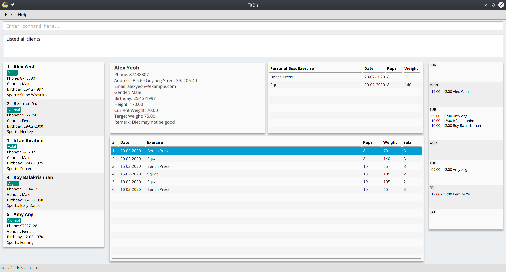

= FitBiz
ifdef::env-github,env-browser[:relfileprefix: docs/]

https://travis-ci.com/AY1920S2-CS2103T-F11-2/main[image:https://travis-ci.com/AY1920S2-CS2103T-F11-2/main.svg?branch=master[Build Status]]
https://coveralls.io/github/AY1920S2-CS2103T-F11-2/main[image:https://coveralls.io/repos/github/AY1920S2-CS2103T-F11-2/main/badge.svg?branch=master[Coverage Status]]

ifdef::env-github[]

endif::[]

ifndef::env-github[]
image::images/Ui.png[width="600"]
endif::[]

* The Fitness Business Management App you never knew you needed
* Tailored made for fitness coaches to manage their clients without the hassle of traditional pen and paper
* Here are some things you can do:
** Track your client's exercises and training schedules
** Display detailed graphs and charts of your client's training data
** Export a client's training data in `csv` format, allowing clients to easily store or view their own data on Excel

== Site Map

* <<UserGuide#, User Guide>>
* <<DeveloperGuide#, Developer Guide>>
* <<AboutUs#, About Us>>
* <<ContactUs#, Contact Us>>

== Acknowledgements

* Adapted from the https://se-education.org/[AddressBook-Level3 project] created by SE-EDU initiative
* Some parts of this sample application were inspired by the excellent http://code.makery.ch/library/javafx-8-tutorial/[Java FX tutorial] by
_Marco Jakob_.
* Libraries used: https://openjfx.io/[JavaFX], https://github.com/FasterXML/jackson[Jackson], https://github.com/junit-team/junit5[JUnit5]

== Licence : link:LICENSE[MIT]
